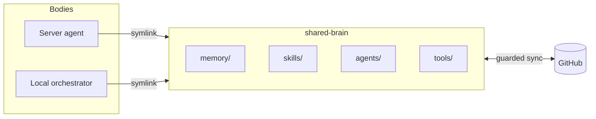

# Architecture

The shared brain is a **substrate**, not an agent. It does nothing on its own.
Its whole job is to be one consistent, inspectable, version-controlled body of
knowledge that many narrow agents can stand on. Three properties make that work:
how bodies read it, how it stays in sync, and how it stays safe.



## 1. How a body reads the brain

Each body symlinks the brain's content into its own working directory:

```
<body>/skills/<name>  ->  shared-brain/skills/<name>
<body>/memory         ->  shared-brain/memory
```

This one decision has a large consequence: **a change to the brain is live the
instant it's written** — before anything is committed, before it reaches any
other host. The body isn't reading a snapshot; it's reading the working tree.

That single fact drives the two models below. If edits are live immediately,
then:

- a "review before you commit" gate protects nothing (the change is already
  active locally) — so review has to move *after* the change and be
  **guaranteed**, not optional (see the sync model);
- an agent that can edit the brain can edit *its own instructions* — so the
  automation that distributes changes needs **guardrails of its own** (see the
  §4, Security by design).

## 2. What the brain stores

Four content areas, deliberately narrow:

| Area | Purpose | Written by |
| --- | --- | --- |
| `memory/` | Durable facts, one per file, plus an index | Bodies (after tasks), a monthly maintenance job |
| `skills/` | Reusable capability definitions | The operator, in dialog with a body |
| `agents/` | Specialist sub-agent definitions | The operator |
| `tools/` | Deterministic token-free scripts | The operator |

Everything else — the wiring that connects bodies to the brain, host config,
the sync script itself — lives **outside** these paths. The automated sync is
scoped to content only; it can never rewrite the rules it runs under. That
boundary is enforced, not just documented (see §4, Security by design).

## 3. How it stays in sync

A small dependency-free script on each host commits, pushes, and pulls on a
timer — no manual git — with four guardians that **halt and notify** instead of
pushing anything surprising, and a heartbeat so a dead daemon is visible at a
glance.

Full detail: **[docs/syncing-across-hosts.md](docs/syncing-across-hosts.md)**.

## 4. Security by design

This brain is read every day by an agent that can run code, holds credentials,
and processes untrusted inbound content. That combination is the **lethal
trifecta** (Simon Willison's term): private data, exposure to untrusted content,
and a way to reach the outside world. Any system with all three can be told, by
an attacker's text, to read something private and send it somewhere you don't
control.

The reason you can't prompt your way out of it: an LLM **cannot separate
instructions from data**. Everything it reads enters the context as tokens, and
it doesn't distinguish the sentences you wrote from the ones an attacker slipped
into an email. So prompt injection is a property of the architecture, not a bug
to patch — and a rule like "never touch the credentials" in the system prompt is
documentation, not a control.

The design response is structural, not textual: **guarantee that in any
execution path at least one leg of the trifecta is missing.**

- **Cut the data leg where code runs.** Execution happens in a rootless,
  unprivileged sandbox with no credential material mounted — from inside, there
  is simply nothing to read. The trifecta's "private data" leg doesn't exist for
  anything the agent runs.
- **Cut it again between agents.** Sub-agents get only the tools their one job
  needs. The component that reads the web carries no mail or document access, so
  the part touching untrusted content can't also reach private data.
- **Cut the exit leg for consequential actions.** Nothing is sent, posted,
  published, or purchased on its own. Outward actions are prepared as drafts and
  proposals; a human confirms. Untrusted content can shape a *suggestion*, never
  trigger an *action*.
- **Make the knowledge base reversible.** Every change is a version-controlled
  commit, distributed by an automation scoped to content only that can't rewrite
  its own rules. History is the quarantine and the rollback path
  ([docs/syncing-across-hosts.md](docs/syncing-across-hosts.md)).
- **Keep it observable.** Actions leave an audit trail; the sync leaves a
  heartbeat. Behavior can always be reconstructed.

Each layer is built to assume the ones around it can fail — no single boundary
is load-bearing alone. The same coverage also maps cleanly onto the OWASP Top 10
for Agentic Applications (2026); the trifecta is just the sharper way to reason
about *why* each boundary is there.

## Why this holds up

- **One source of truth.** Bodies that should agree, agree — they read the same
  files.
- **Inspectable and revertible.** The brain is text under git; any change can be
  read, diffed, and undone.
- **Small blast radius.** The sync touches content only; the publish key lives
  with the host, not the agent; execution happens where the secrets aren't.
- **Never silent.** Sync runs leave a heartbeat; tool calls leave an audit
  trail. "Why did it do that?" always has an answer.
