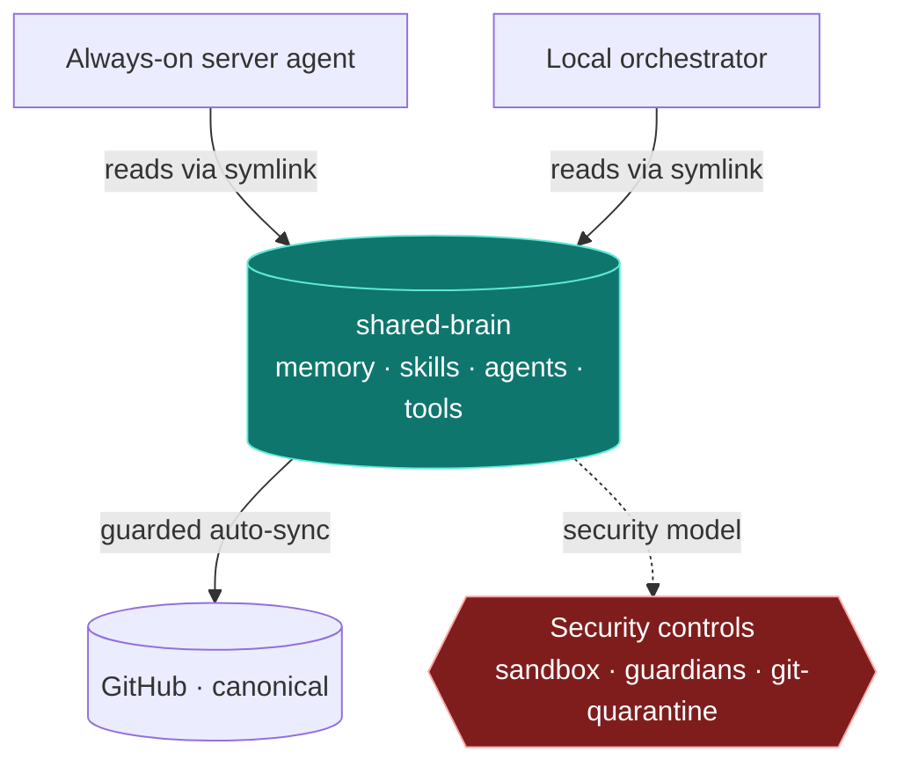

# shared-brain — one brain, many bodies

> A plain-Markdown store of memory, skills, and agent definitions that several
> independent agents read from as their shared substrate — kept identical
> across hosts by a guarded auto-sync, and secured against the failure modes of
> an always-on agent that reads untrusted content all day.

Most agent setups put memory *inside* the agent. This one pulls it out. The
brain is a folder of Markdown files that lives on its own; the agents are
**bodies** that read it through a symlink into their working directory. Change a
skill or a fact once, and every body sees it — the always-on server agent and
the local orchestrator alike.

This repository is a **sanitized, generalized showcase** of that substrate — the
structure, the sync model, and the security model — with all
company-, tool-, and host-specific detail removed. It's meant to be read, not
run as-is. See [Status & scope](#status--scope).

---

## The shape of it

The bodies are documented in their own repos; this repo is only the thing they
share.

---

## Why a shared brain instead of memory-per-agent

| Memory inside each agent | A shared brain |
| --- | --- |
| Every agent relearns the same facts | Learn once, every body reads it |
| Drift between agents that should agree | One source of truth, symlinked in |
| Memory dies with the runtime | Plain files; outlives any one agent |
| No history, no rollback | Git-versioned — every change is diff-able and revertible |
| "Improve the prompt" is the only knob | Skills, agents, and facts are editable artifacts |

The leverage isn't a smarter model — it's **one inspectable substrate** that
many narrow agents stand on, with version control as the safety net underneath.

---

## What's in the brain

Four content areas, and nothing else the automation is allowed to touch:

| Area | Holds |
| --- | --- |
| `memory/` | One fact per Markdown file — who the operator is, standing feedback, project constraints, references. See [docs/memory-model.md](docs/memory-model.md) |
| `skills/` | Reusable capability definitions the bodies load on demand |
| `agents/` | The specialist sub-agent definitions |
| `tools/` | Small deterministic scripts (token-free helpers) |

Wiring and host config live **outside** these paths on purpose — the automated
sync is never allowed to rewrite the rules it runs under.

---

## Read next

- **[ARCHITECTURE.md](ARCHITECTURE.md)** — the substrate: how bodies consume the
  brain, why "read via symlink" drives the sync model, and **Security by
  design** — how the lethal trifecta is broken structurally so prompt injection
  can't turn into data loss (also mapped to OWASP ASI 2026).
- **[docs/memory-model.md](docs/memory-model.md)** — plain-Markdown memory:
  one fact per file, an index, read-before / write-after.
- **[docs/syncing-across-hosts.md](docs/syncing-across-hosts.md)** — how the
  brain stays byte-identical across hosts, with four guardians and a heartbeat.

---

## The bodies (separate repos)

- **Always-on server agent** — runs scheduled operations and a chat frontend, 24/7.
- **Local orchestrator** — a conductor agent delegating to a fleet of specialists.

Both read this brain; neither owns it.

---

## Status & scope

This is a **showcase**, not a product. The real brain backs private mailboxes,
calendars, and operational data; everything here is generalized and stripped of
company-, tool-, and host-specific detail. There's no install path because the
value is the **architecture and the patterns**, not a turnkey binary.

Built with agent runtimes on top of [Claude Code](https://claude.com/claude-code).

Shared for reference, not licensed for reuse.
