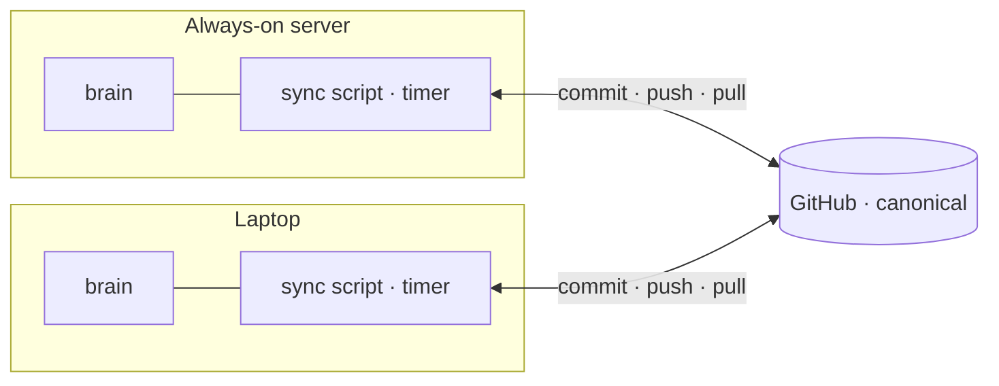

# Syncing across hosts

The brain is only useful if every body sees the *same* one. But it doesn't live
in one place: an always-on server runs the scheduled work, a laptop runs the
interactive work, and GitHub holds the canonical copy. Three locations, one
brain — they have to agree, continuously, without anyone remembering to
`git push`.

This is the plumbing that lets "just a folder of Markdown files" survive being
edited from two machines and a background scheduler at once.

## The problem with "just commit it"

The bodies read the brain through a symlink into their working directory. A
change written on the server is therefore **live immediately** — long before
anyone commits it. So a manual "review before push" gate protects nothing: by
the time you'd review, the change is already shaping the server's behavior. All
the gate does is delay the change reaching the *other* hosts.

So the model is inverted: **distribute automatically, review after — with a
one-command undo in every notification.** Review moves from "before, if I
remember" to "after, guaranteed."

## The shape of it

A small, dependency-free script runs on each host on a timer (about every 15
minutes). It stages changes under the brain, commits them with a generated
message, pushes, and fast-forwards anything the other host pushed. One script,
both hosts — it detects where it's running. No manual git in the loop.

## Four guardians

The script is not a blind `git add -A && git push`. Four checks each **halt and
notify** instead of pushing — so an automated loop can never quietly do
something irreversible:

| Guardian | Guards against |
| --- | --- |
| **Secret scan** | A credential or token accidentally written into a note — this makes the "no secrets in the brain" rule *enforceable*, not just written down. `.gitignore` catches filenames; it does not catch a token pasted mid-file |
| **Scope guard** | Anything outside the content paths (`memory/`, `skills/`, `agents/`, `tools/`). An agent that rewrites its own wiring or config is changing the rules it runs under (see Security by design in [ARCHITECTURE.md](../ARCHITECTURE.md)) |
| **Remote pinning** | A bent-back `origin` remote, or a branch that isn't the main one — an exfiltration path — is caught *before* any commit, not after |
| **Size brake** | An unusually large diff (many files, or a big deletion) is handed to a human. Overwriting instead of appending belongs in front of a person |

On a real divergence — both hosts changed the same thing — the rebase is
**aborted, never guessed**. The operator gets a message with the reason and a
revert command; nothing moves until it's resolved. Resolving it automatically
would mean deciding which version of the brain is the true one.

## Why the script lives outside the brain

The sync script is deliberately **not** in the repo it syncs. It sits in host
config the agent's execution sandbox can't reach. The reasoning is blast radius:
the deploy key that can push to GitHub must be unreachable to the agents
themselves. The agents can write *notes*; only the host can *publish* them — and
an agent can't edit its own gatekeeper. The two host copies are kept identical
and checksum-verified, so the gatekeeper is the same on every machine.

## Observability

A silent automation is a liability — if it dies, you find out when the brain has
already gone stale. So every run leaves a trace:

- On the server, the timer runs under the init system's journal, which
  timestamps every invocation for free.
- On the laptop, the plain log gets a **heartbeat**: one timestamped line per
  run, even when there's nothing to sync. A gap in the heartbeat is a dead
  daemon, visible at a glance.

Neither is clever. Both make the answer to "is the brain still syncing?" one
command away.

## Why this holds up

- **No lost edits.** A change on any host reaches the others within a cycle,
  automatically.
- **Nothing irreversible.** Every guardian halts rather than forces; every
  notification carries an undo.
- **Small blast radius.** The publish key lives with the host, not the agent.
- **Never silent.** Heartbeat and journal make a stall visible before it turns
  into stale memory.

The point isn't the sync itself — it's that a plain-Markdown brain can be
**shared across machines and a background scheduler** without a database,
without manual git, and without ever letting an automated loop do something you
can't undo.
